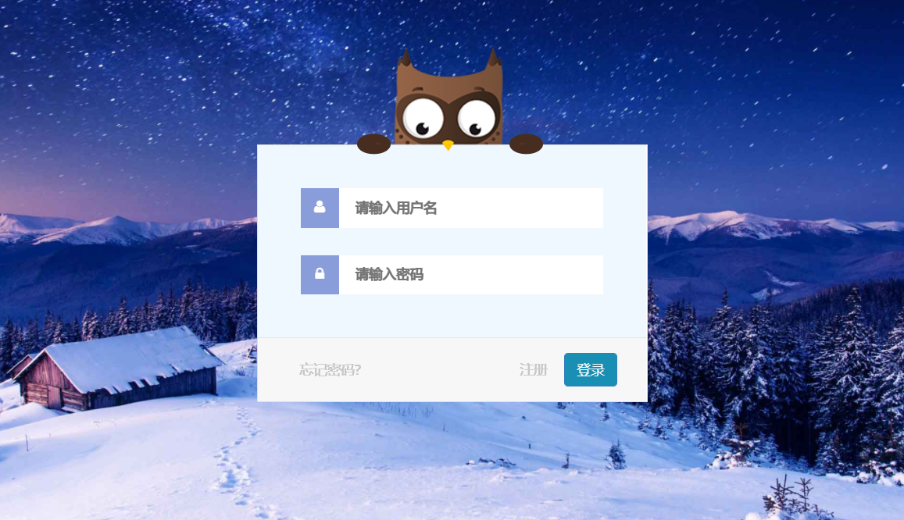
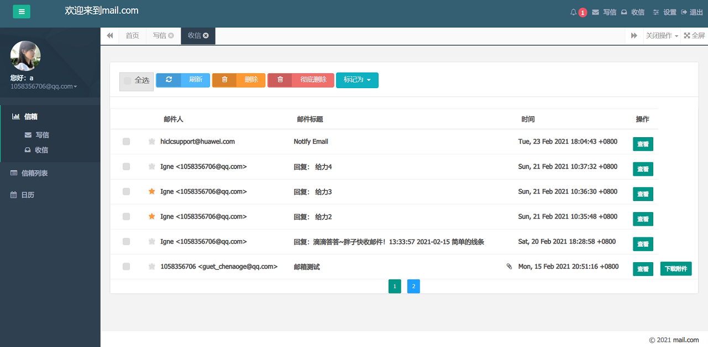

## 邮件收发
- 基于 **imapclient** 实现imap协议收取邮件及下载附件
- 基于 **poplib** 实现pop协议收取邮件及下载附件
- 基于 **smtplib** 实现smtp协议发送邮件

## 运行方法

#### 安装环境

```sh
pip install requirements.txt
```

#### 修改配置

修改配置文件 **config.py**

#### 运行项目

```sh
python run.py
```

## 项目界面







